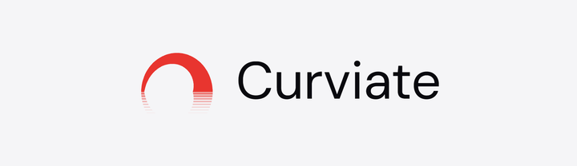

<picture>
  <source media="(prefers-color-scheme: dark)" srcset="./assets/curviate-lockup-horizontal-dark.png">
  
</picture>

# @curviate/mcp

A thin stdio bridge to the hosted [Model Context Protocol](https://modelcontextprotocol.io) server for the
[Curviate API](https://docs.curviate.com): LinkedIn actions for AI agents.

This package ships **no LinkedIn tool implementations and no tool copy**. It forwards every MCP message,
`initialize`, `tools/list`, `tools/call`, and everything else a client sends, between your stdio-only MCP
client and the hosted endpoint at `https://app.curviate.com/mcp`. The hosted server is the single source of
truth for the tool surface, so this bridge tracks it with zero drift: a new tool, a changed schema, an updated
description, all show up the moment the hosted server ships them, with no bridge release required.

## Do you need this package at all?

If your client has native remote MCP support (Claude Code, Claude Desktop Connectors, Claude.ai, ChatGPT
Developer Mode, Cursor, VS Code), you can point it at the hosted endpoint directly and skip installing
anything:

```bash
claude mcp add --transport http curviate https://app.curviate.com/mcp --header "Authorization: Bearer <your-api-key>"
```

Use this package when your client only supports **stdio** MCP servers, or when you specifically want a
locally-spawned process (a forkable, inspectable artifact you can vendor and pin a version of).

## Install

### npx (no install required)

```bash
npx @curviate/mcp
```

### Claude Code

```bash
claude mcp add curviate -e CURVIATE_API_KEY=<your-api-key> -- npx -y @curviate/mcp
```

### Claude Desktop

Add to your `claude_desktop_config.json`:

```json
{
  "mcpServers": {
    "curviate": {
      "command": "npx",
      "args": ["-y", "@curviate/mcp"],
      "env": {
        "CURVIATE_API_KEY": "<your-api-key>"
      }
    }
  }
}
```

### Cursor

Add to `.cursor/mcp.json`:

```json
{
  "mcpServers": {
    "curviate": {
      "command": "npx",
      "args": ["-y", "@curviate/mcp"],
      "env": {
        "CURVIATE_API_KEY": "<your-api-key>"
      }
    }
  }
}
```

### VS Code (Copilot Chat)

Add to `.vscode/mcp.json` (note the top-level key is `servers`, not `mcpServers`):

```json
{
  "servers": {
    "curviate": {
      "type": "stdio",
      "command": "npx",
      "args": ["-y", "@curviate/mcp"],
      "env": {
        "CURVIATE_API_KEY": "<your-api-key>"
      }
    }
  }
}
```

## Configuration

| Variable | Required | Description |
|---|---|---|
| `CURVIATE_API_KEY` | Yes | Your Curviate API key, from the [Curviate dashboard](https://app.curviate.com). Sent to the hosted endpoint as `Authorization: Bearer <key>`. |
| `CURVIATE_MCP_URL` | No | Overrides the hosted MCP endpoint. Defaults to `https://app.curviate.com/mcp`. Useful for pointing the bridge at a staging or self-hosted environment. |

Both also accept a CLI flag fallback, `--api-key <key>` and `--mcp-url <url>` (or the `--flag=value` form). A
key passed as `--api-key` is visible to other users on the machine through `ps`/process listings and lands in
shell history, prefer the environment variable in every context where it's available; the bridge prints a
warning to stderr when the flag is used.

```bash
npx @curviate/mcp --api-key <your-api-key> --mcp-url https://app.staging.curviate.com/mcp
```

## How it works

The bridge holds two MCP transports and relays messages between them, unmodified, in both directions:

- **Local**: a standard stdio transport, the side your MCP client talks to.
- **Remote**: a Streamable HTTP transport to `CURVIATE_MCP_URL`, authenticated with your API key as a bearer
  token.

There is no tool registry, no per-method handling, and no schema validation in between. Whatever the hosted
endpoint returns, including a tool's structured error body, streams back to your client exactly as received.
The entire implementation is a few hundred lines (`src/bridge.ts`, `src/config.ts`, `src/index.ts`), short
enough to read in a few minutes if you want to verify exactly what it does before running it.

## Tools

The tool surface is discovered at runtime through the standard MCP `tools/list` call, the same introspection
any MCP client already uses, there is no hardcoded tool table here to go stale. See
[docs.curviate.com](https://docs.curviate.com) for the current reference documentation.

## Errors

A failed call returns whatever `isError` result and structured error body the hosted endpoint sent, the
`{ code, message, retry_hint, user_fixable, retry_likely_to_succeed }` shape documented at
[docs.curviate.com](https://docs.curviate.com), verbatim. Nothing is translated or re-wrapped in the bridge, an
agent branching on `code` sees exactly what the hosted MCP endpoint returned.

If the bridge itself cannot reach the hosted endpoint (a network failure, a bad `CURVIATE_MCP_URL`), it
synthesizes a JSON-RPC error response for the pending request rather than hanging your client indefinitely.

## License

[MIT](./LICENSE)
